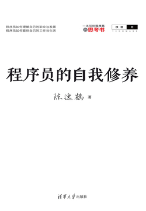

## 《程序员的自我修养》

作者 *陈逸鹤*

### 总结

**学会了做事/自我完善/增长技术方法:** 

+ 找对方法, 善于沟通, 努力. 

**面试时:** 

+ 简历遵循STAR准则, 情景, 目标, 行动, 结果, 表达得一针见血, 清清楚楚才行. 
+ 深刻理解自己所擅长的, 扬长避短. 
+ 打牢基础, 有技术深度

**你应该了解的事:** 

+ 掌握英语

+ 学会包装
+ 也看些与技术无关的书
+ 会写文档
+ 勇敢交流, 并维持社会关系
+ 提高效率, 用于持续学习
  + 想办法解决重复低效的工作
  + 加快工作节奏
  + 借助工具完成工作

**对提升程序员思维有所帮助的几点建议:** 

+ 长期不间断地编程实践
+ 持续地学习与借鉴(参考)
+ 学会反思，并像专家一样思考

### 第一章 谈职业生涯

1. 正确认识自己

2. **比一般人更努力**

3. 建立个人权威或品牌

4. 遵循最佳实践

5. 乐于探索新事物

6. 善于沟通

7. 为优秀的人工作

8. 生活, 睡眠, 旅行

   你需要合理规划自己的时间分配（学习、阅读、写代码）并持之以恒地去做. 

9. 相信自己的天赋和创造力

   + 阅读
     + 记录和搜集
       + 尝试动手

如果这些没用, 遵循第二条, 所以这章最主要是**比别人更努力**(甚至是全文重点, 找对方法, 善于沟通, 努力不懈). 

### 二、那些程序员们后知后觉的职涯经验

1. 你的薪酬与工作量无关

   你的薪酬其实取决于很多因素，技术能力、经验资历、工作量等，但最本质的却是，你对公司是否重要，换句话说你是否容易被取代。

2. 尽可能持续做一件事。

   在某一项技术上达到理想的深度. 

3. 唯一不变的就是变化本身. 

   同样是钻研技术, 提升快速学习的能力. 如此你才能面对不断出现的变化. 

4. 声誉非常重要

5. 沟通

6. 学会软技能, 提升一些非技术能力

7. 不要轻易说不可能或太简单

8. 团队合作(还是沟通)

9. 你的能力显而易见

   *好精辟啊*

   > 能力来自于大量的编码实践，以及持续学习的能力和勤于思考的习惯。

### 三、如何招到一名靠谱的程序员

你需要用尽可能简练的文字来描述项目的背景，你在项目中承担的角色、参与项目的时长，你用到的技术，以及你在项目中的亮点等信息。优秀的程序员们往往善于归纳，并能够一针见血地发现问题或把一个问题说清楚。

请谈谈你在这个项目中遇到的最大困难或挑战是什么，你是如何解决的。从面试者对上面这个问题的回答中，我能够很好地判断他是否有较强的独立解决问题的能力，而我认为这是除技术能力之外，程序员最应具备的能力。

*所以说真的要写blog，并且不断挖掘其中原理*

> 请谈谈你在这个项目中遇到的最大困难或挑战是什么，你是如何解决的。
> 从面试者对上面这个问题的回答中，我能够很好地判断他是否有较强的独立解决问题的能力，而我认为这是除技术能力之外，程序员最应具备的能力。

### 四、每个程序员都应该了解的一件事

学会包装
也看些与技术无关的书
会写文档
勇敢交流

### 五、程序员的烦恼

想办法解决重复低效的工作，而不是逃避它们你不应该总是陷入在那些处理杂事的循环往复之中，跳出来，创造更好的方式去解决它们才是应对之策。

创业大多是在一个新的领域中进行的，你不应仅仅专注于公司所使用的那些技术，而更需要通过深入理解这个新的领域，去获得不同的视角和眼光，因为它们也会在未来成为你的核心竞争力。

技术是需要深耕的，深入学习一门主流的开发技术，并不断提升编程思维，比对很多技术栈都浅尝辄止要好很多。

### 六、提给年轻程序员的职涯建议

这就是自己的弱点，静不下来，快不起来应该尽可能地提高自己的工作效率。

应该尽可能地提高自己的工作效率。

*用好工具，加快节奏，专注于此*

> 对于提高工作效率，我有以下两点建议：
> •加快工作节奏。
> •借助工具完成工作。

*好赞同*

> 掌握英语
> 如果你在外企，那么英语作为一项必备技能是非常重要的。但即使你是在一家国内的企业，你仍然应该掌握英语，因为它能够帮助你获得更宽广的视野，带来更多的工作机会。

睡眠使你更加强大

### 第二章 谈实践与认知

### 一、突破程序员思维

程序员思维是由常人的思维+编程思维，在长期相互作用下产生的一种思维模式。它能够帮助程序员快速找到以程序方式解决现实问题的最优解。

对提升程序员思维有所帮助的几点建议: 

+ 长期不间断地编程实践
+ 持续地学习与借鉴(参考)
+ 学会反思，并像专家一样思考

为什么要突破:

+ 只有全面才能走得更远. 

如何突破: 

+ 寻找本质

+ 多看杂学(非本专业领域), 获取不同视角

### 二、全栈工程师如何快速构建一个Web应用

Web开发的各个重要阶段: 

1. 网站定位与功能设定(受众, 核心功能)
2. 信息架构(比如面向对象, 等优秀的架构[你懂的, 比如UML]和设计思想)
3. UI设计
4. 应用架构(前后端框架)
5. 开发
6. 部署
7. 性能调优
8. *网站数据统计

文档的必要性: 

+ 仅当确认文档能够产生价值时，才去编写它们, 如果编写, 则要清晰明白。

### 三、如何成为一名优秀的全栈工程师

全栈工程师的定义: 

我认为全栈工程师应该同时是一位资深开发工程师、架构师，以及具有敏捷开发技能的程序员。

要掌握所有技术是根本不可能的，而成为全栈工程师也并不需要你真得掌握所有的技术，你应该将自己的精力聚焦在关键开发技能，以及一些必须掌握的附加技能上。

但你需要掌握: 

1. 关键开发技能(硬实力)

2. 软实力

   1. 沟通
   2. 问题解决能力
   3. **时间管理**(我觉得这是人生最重要的事情)
   4. 好奇心
      + 对于将持续学习作为一种生活习惯的人来说，学习新东西并不会成为一种负担，反而是一种乐趣。

     5. 领导力

3. 你应该走出去

   + 优秀的全栈工程师不应局限于自己的工作，他更应该走出去，接触不同的技术，分享自己的经验和心得，认识更多的朋友。
   + 可以参加很多大会, 参加线下活动
   + 可以写个人博客, 每天进步一点点

   

### 五、重构——系统改善之道

应该持续重构, 这个要专门学习, 概括不完

### 六、程序员也该懂得"这样就好"

无必要, 不应该增加太多附加功能, 而应该专注于现有功能的优化. 

做产品应该注意: 

+ 不盲目使用新技术
+ 避免过度设计
+ 不在项目中技术镀金------指在开发中追求技术的过度完美性, 而极大增加了工作量. 

### 七、走出软件开发法则

1. 面向对象
2. 测试很重要
   1. 集成测试越早越好
3. 合理运用新的方法论

### 九、一名全栈工程师的Mac工具箱（设计、开发、效率）

学习任何一个工具软件都需要花费时间或是金钱，因此应选择那些值得投资的软件或工具去购买和学习。(**我觉得这句话非常好**)

### 十、我似乎理解了编程的意义

看这本书是为了明白你要从事的职业需要做什么，学什么，怎么做，将来如何发展

### 第三章 谈个人发展

### 一、那些优秀程序员身上的共同特质

1. 至少深入理解一门编程语言

2. 看上去有些“傻”
   1. "傻"------知道自己不够聪明, 努力变得更加强大. 
3. 他们都是现实主义者
   1. 优秀的程序员懂得平衡
4. 从失败中学习
5. 很懒又很高效
   1. 他们能够熟练地使用IDE，他们不依赖菜单，而是使用快捷键来操控代码，从查找文件、文本编辑到格式化代码、文本替换都尽可能使用快捷键，这使得他们的开发工作更加连贯，也更高效。•他们善于使用或发明工具，他们寻找一切能提高效率的工具，必要时他们还自己编写自动化脚本、发明新的工具，从而彻底抛开那些恼人的重复劳动或机械性工作。
6. 善于发现并改造轮子
7. 还是时间管理
8. 还是软技能

### 三、专家与普通人的区别在于觉察力

同样的，在编程领域，专家与普通人的区别也在于是否能够更好地解决问题，而解决问题的关键又在于程序员身上的敏锐觉察力。

### 六、建立自己的个人品牌

建立个人品牌

### 九、你也可以写出优秀的技术博客

要写blog

*收益良多*

> 下面是我经常采用的写作步骤：
> ①确定一个要写的主题。
> ②在网上寻找到那些能够帮助你完善观点的参考资料。
> ③列出文章的提纲。
> ④根据提纲完善内容。
> ⑤反复修改，直到文章通顺易读（有时我也会找人试读，并听取他们的意见）。
> ⑥给文章配一个好的标题。
> ⑦发布你的文章。

下面是我经常采用的写作步骤：

1. 确定一个要写的主题。

2. 在网上寻找到那些能够帮助你完善观点的参考资料。

3. 列出文章的提纲。

4. 根据提纲完善内容。

5. 反复修改，直到文章通顺易读（有时我也会找人试读，并听取他们的意见）。

6. 给文章配一个好的标题。

7. 发布你的文章。
8. 

### 二、为什么我们不再购买技术类书籍

因为基础扎实, 技术深度足够, 见识广博后可以直接读文档. 

但仍应该学习: 人物传记、实践方法、设计思想类和其他人文类书籍. 

### 五、写作与写代码

都是将细节组合成更美的东西

### 第五章 谈自学设计

学习思想，而不是形于工具，编程也是如此，不要一直跟潮配置不同的环境。

我要找的是那些优秀设计师们自己对于设计的感悟、设计心得、推荐阅读的设计类书籍等。

*专注于手中事*

> 你所做的每一件事情，它的背后都可以和艺术联系在一起。只要是付出了努力，精心制作，并能反映出作者情感与灵魂的东西都可以称为艺术品

你所做的每一件事情，它的背后都可以和艺术联系在一起。只要是付出了努力，精心制作，并能反映出作者情感与灵魂的东西都可以称为艺术品. 

### 二、那些永恒的设计原则

设计应源于对问题本身的思考，并做出能够解决问题的相应设计。

### 四、因为“美”而学习设计

而那一刻，我明白了“美”无法从自以为是或简单模仿中获得. 

### 五、浅谈企业级产品设计

我们可以尝试改变与用户的沟通策略，通过一些需求讨论会，更多地了解他们的实际工作，而不是直接让他们给出设计建议。

---

