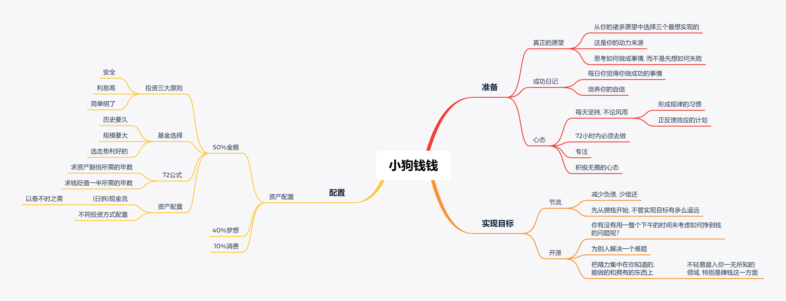

## 《小狗钱钱》
作者 *博多·舍费尔*

### 总结

### 前言

认为我们必须忍受拮据的生活，甚至认为这样才是高尚的——这种想法是人类犯下的最重大的错误之一。

实际操作并不是一件简单的事。获取财富的法则虽然很容易理解，但是实际运用却并不容易，所以我们常常需要别人的帮助

### 第三章 达瑞，一个很会挣钱的男孩

第一，为别人解决一个难题，那么你就能赚到许多钱；第二，把精力集中在你知道的、能做的和拥有的东西上。

### 第四章 堂兄的挣钱之道

你有没有用一整个下午的时间来考虑如何挣到钱的问题呢？

情况顺利的时候，人人都能挣到钱。只有在逆境中，一切才能见分晓。

### 第五章 钱钱以前的主人

但怎么分辨最重要的事情呢，列张表每隔一段时间去思考吗，像番茄钟一样许多没有钱的人爱犯的错误。他们总是有那么多紧急的事情要做，以至于没有时间来关注重要的事情

许多没有钱的人爱犯的错误。他们总是有那么多紧急的事情要做，以至于没有时间来关注重要的事情

在遇到困难的时候，仍然要坚持自己的想法。

*不错的方向，坚持，专注是让你相对体面走完一生的好方式*

> 你每天还是要不间断地去做对你的未来意义重大的事情。

你每天还是要不间断地去做对你的未来意义重大的事情。

*容易坚持的最简单方法是规律的计划*

> 有成千上万件事情可能让你分心，因此你每天应该在固定的时间里，有规律地做这些事情

有成千上万件事情可能让你分心，因此你每天应该在固定的时间里，有规律地做这些事情

*我觉得是48小时*

> 当你决定做一件事情的时候，你必须在72小时之内完成，否则你很可能永远不会再做了。

当你决定做一件事情的时候，你必须在72小时之内完成，否则你很可能永远不会再做了。

### 第六章 爸爸妈妈犯下的错误

正反馈效应。它每取得一点儿小小的进步，我都会表扬它，还经常给它奖励。钱钱也同样执行我的每一个命令，这对拿破仑非常有帮助。几个小时之后，拿破仑已经能很好地完成“坐下”的动作了。

应当开始攒钱，他们不需要等到还清债务以后再开始存钱，他们可以现在立即开始，只有这样，他们才有能力在不申请新的贷款的情况下，满足自己的愿望

### 第七章 在金先生家

利用专注

> 越是把注意力放在疼痛上，我就越会觉得疼。谈论疼痛就像给植物施肥一样。所以我很多年以前就改掉了抱怨的习惯。

### 第十一章 爸爸妈妈不明白

不试图掌控一无所知的领域

> 他的精力究竟是集中在自己的能力范围之内，还是放到了他力所不能及的事情上，这也是很重要的一点。没有我的成功日记本，我就不会去思考自己适合在哪些方面赚钱。

### 第十二章 陶穆太太归来

不要想着如果有钱，而应该想如何有钱他们相信，要是不用为钱发愁的话，他们就可以活得很好。

他们相信，要是不用为钱发愁的话，他们就可以活得很好。

*想着当下应该如何努力去做，而不是害怕做不好*

> 现在，我把更多的注意力放在我能够做到的事情上。所以，我更多的是去寻找解决的办法，而不是寻找开脱的借口

**我生命中出现了最美好的东西，是因为我做了原本不敢做的事。**

### 第十三章 巨大的危机

积极无畏的心态，会让你找到相对正确的方向和制定具有正反馈的计划。而规律的坚持，持续的专注可以让你在这方向走向成功当你朝着积极的目标去思考的时候，就不会心生畏惧

当你朝着积极的目标去思考的时候，就不会心生畏惧

### 第十四章 投资俱乐部

安全，利息高，简单明了，但我认为简单明了在现在工具丰富的时代，可以随着技术深入而逐渐放弃

### 第十八章 大冒险的结局

只要学会把某些自己不喜欢做而又不擅长做的事情交给别人就行了

---
2020年5月18日