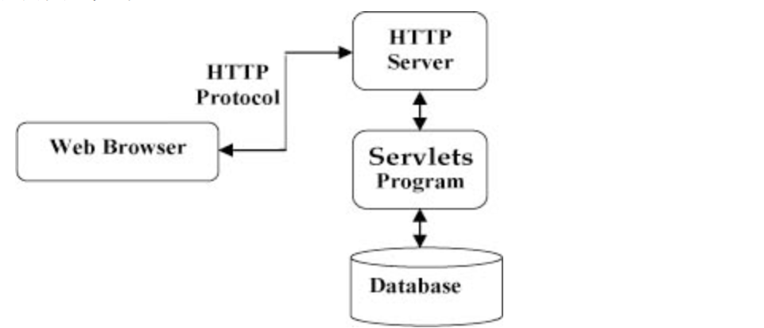

### 本课目标

​	介绍Servlet是什么, 版本特性, 比如3.0版本和4.0版本, 然后通过几个Servlet程序演视了Servlet不同版本的特性. 

### Servlet简介

​	`Java Servlet` 运行在`Web`服务器或应用服务器上的程序, 作为来自`Web`浏览器或其他`HTTP`客户端的请求和`HTTP`服务器上的数据库或应用程序之间的中间层. 

**优势:** 

		+ 性能更好
		+ 使用更方便
		+ 全平台
		+ 安全可信
		+ 可以用`Java`类库的全部功能, 可以通过`sockets`和`RMI`机制与`applets`, 数据库或其他软件进行交互. 

### Servlet 架构

​	`Servlet`在`Web`应用程序中的位置. 

### Servlet 任务

**Servlet的主要任务: **

+ 读取客户端发送的显式数据(如`HTML`表单)和隐式数据(如`cookies`). 

+ 处理数据并生成结构. 
+ 显式的数据或隐式的数据到客户端. 

### Servlet环境设置

