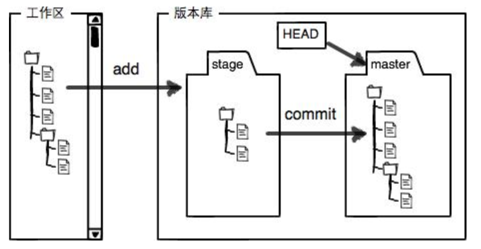

### [时光穿梭机](https://www.liaoxuefeng.com/wiki/896043488029600/896954074659008)

`git status`可以让我们时刻掌握仓库当前状态. 比如我更改了这个文件. 

```shell
$ git status
On branch master
Changes to be committed:
  (use "git reset HEAD <file>..." to unstage)

        modified:   Learning-Git/LiaoXueFeng_Git_Course/LiaoXueFengGitCourse_02_Git_verison.md

Changes not staged for commit:
  (use "git add <file>..." to update what will be committed)
  (use "git checkout -- <file>..." to discard changes in working directory)
  (commit or discard the untracked or modified content in submodules)

        modified:   Blog/themes/hexo-theme-matery (modified content)
        modified:   Learning-Git/LiaoXueFeng_Git_Course/LiaoXueFengGitCourse_02_Git_verison.md

```

会提示这个文件已经被修改过了, 但是还没有准备提交的修改. 


`git diff`可以和上次提交相比较, 查看具体修改的内容. (可以加文件名, 也可以不加, 不加的话是全部修改过的文件)


然后用`git add`命令提交到缓冲区, 再使用`git commit`命令提交就好了. 


#### 小结

+ 要随时掌握工作区的状态, 使用`git status`命令. 
+ 如果`git status`告诉你有文件被修改过, 用`git diff`可以查看修改内容. 


### [版本回退](https://www.liaoxuefeng.com/wiki/896043488029600/897013573512192)


不断地对文件进行修改, 然后不断提交到版本库里, 就像游戏存档. 

随着时间地推移, 我们已经记不住我们修改地版本有哪些, 这时候可以使用`git log`命令查看. 

```shell
$ git log
commit adc1a90446a667785ab856e342e31506b90b285c (HEAD -> master)
Author: junksheng <junk.sheng@foxmail.com>
Date:   Mon May 11 20:14:17 2020 +0800

    Learn the Git about Liaoxvefeng in 版本回退

commit 16cbbfdbe70091fe011bac8970b00fb992151d14
Author: junksheng <junk.sheng@foxmail.com>
Date:   Mon May 11 20:05:10 2020 +0800

    Learn the Git about Liaoxvefeng

commit 2e4ba41d528c453cdd4883c5480d194cc6f92580
Author: junksheng <junk.sheng@foxmail.com>
Date:   Mon May 11 19:55:27 2020 +0800

    the git init
```

`git log` 命令显示从最近到最远的提交日志, 如果嫌输出信息太多, 看得眼花缭乱的, 可以试试加上`--pretty=oneline`参数: 

```shell
$ git log --pretty=oneline
adc1a90446a667785ab856e342e31506b90b285c (HEAD -> master) Learn the Git about Liaoxvefeng in 版本回退
16cbbfdbe70091fe011bac8970b00fb992151d14 Learn the Git about Liaoxvefeng
2e4ba41d528c453cdd4883c5480d194cc6f92580 the git init
```

会显示每一次的 `版本号+commit说明`. 


`$ git reset --hard HEAD^`回退到上一个版本

```shell
$ git add .

$ git commit -m "版本回退尝试"
[master d659bf7] 版本回退尝试
 1 file changed, 38 insertions(+), 1 deletion(-)
 
$ git add .

$ git commit -m "废弃的版本"
[master a037a10] 废弃的版本
 1 file changed, 2 insertions(+)
 
$ git reset --hard HEAD^
HEAD is now at d659bf7 版本回退尝试
```

使用命令`$ git reset --hard HEAD^`可以看到确实从 "废弃的版本" 回退到了 "回退版本尝试". 


运行`git log --pretty=oneline`发现废弃版本不见了.

```shell
$ git log --pretty=oneline
d659bf7378afc82532cf5474f8fa774bd2fdbdbb (HEAD -> master) 版本回退尝试
adc1a90446a667785ab856e342e31506b90b285c Learn the Git about Liaoxvefeng in 版本回退
16cbbfdbe70091fe011bac8970b00fb992151d14 Learn the Git about Liaoxvefeng
2e4ba41d528c453cdd4883c5480d194cc6f92580 the git init
```


"废弃的版本"找不到了, 当如果你没有关闭当前命令行, 你可以找到"废弃的版本"的版本号`commit id`, 使用`git reset --hard 1904a(commit id)`去恢复它, 版本号没必要写全, Git会自动去找. 


我特么, 提交了"废弃的版本"没有查看版本号...所以不能恢复了...

但我会就这样放弃吗? 不可能的.

通过命令`git reflog`可以看到你的`head`指针指过的版本号.

```shell
$ git reflog
d659bf7 (HEAD -> master) HEAD@{0}: reset: moving to HEAD^
a037a10 HEAD@{1}: commit: 废弃的版本
d659bf7 (HEAD -> master) HEAD@{2}: commit: 版本回退尝试
adc1a90 HEAD@{3}: commit: Learn the Git about Liaoxvefeng in 版本回退
16cbbfd HEAD@{4}: commit: Learn the Git about Liaoxvefeng
2e4ba41 HEAD@{5}: commit (initial): the git init
```

这不就有了吗??? 哈哈哈, 但我还是不想回退, 因为我记了笔记了, 麻烦...


#### 小结

+ `HEAD`指向的版本就是当前版本, 因此, Git允许我们在版本的历史之间穿梭, 使用命令`git reset --hard commit_id`.
+ 穿梭前, 用`git log`可以查看提交历史, 以便确定要回退到哪个版本. 
+ 要重返未来, 用`git reflog`查看命令历史, 以便确定要回到未来的哪个版本. 


### [工作区和暂存区](https://www.liaoxuefeng.com/wiki/896043488029600/897271968352576)

Git和其他版本控制系统如SVN的一个不同之处就是有暂存区的概念. 

**名词解释**

##### 工作区(Working Directory)

就是在电脑里能看到的目录, 一个文件夹. 

##### 版本库(Repository)

工作区里面有个隐藏目录`.git`, 这个不算工作区, 而是Git的版本库. 

Git的版本库里存了很多东西，其中最重要的就是称为stage（或者叫index）的暂存区，还有Git为我们自动创建的第一个分支`master`，以及指向`master`的一个指针叫`HEAD`。




前面讲了我们把文件往Git版本库里添加的时候，是分两步执行的：

+ 第一步是用`git add`把文件添加进去，实际上就是把文件修改添加到暂存区；

+ 第二步是用`git commit`提交更改，实际上就是把暂存区的所有内容提交到当前分支。

因为我们创建Git版本库时，Git自动为我们创建了唯一一个`master`分支，所以，现在，`git commit`就是往`master`分支上提交更改。

所以，`git add`命令实际上就是把要提交的所有修改放到暂存区（Stage），然后，执行`git commit`就可以一次性把暂存区的所有修改提交到分支, 然后暂存区又变空了. 


#### 小结

暂存区是Git非常重要的概念, 弄明白了暂存区, 可以明白Git的很多操作到底干了什么. 


### [管理修改](https://www.liaoxuefeng.com/wiki/896043488029600/897884457270432)

Git跟踪并管理的是修改, 而非文件. 

`git commit`只负责把暂存区的修改提交了, 也就是文件修改后使用`git add`命令提交到暂存区的文件被`git commit`提交, 没有使用`git add`的文件修改不会被`git commit`提交. 

可以使用命令`git diff HEAD -- filename` 查看工作区和版本库里面最新版本的区别. 


#### 小结

现在，你又理解了Git是如何跟踪修改的，每次修改，如果不用`git add`到暂存区，那就不会加入到`commit`中。


### [撤销修改](https://www.liaoxuefeng.com/wiki/896043488029600/897889638509536)

​		如果是修改了文件, 但是还没有`git add`, 你希望废弃掉工作区文件的修改: 可以使用使用`git checkout -- file`丢弃工作区的修改. 

命令`git checkout -- readme.txt`意思就是，把`readme.txt`文件在工作区的修改全部撤销，这里有两种情况：

+ 一种是`readme.txt`自修改后还没有被放到暂存区，现在，撤销修改就**回到和版本库**一模一样的状态；

+ 一种是`readme.txt`已经添加到暂存区后，又作了修改，现在，撤销修改就**回到添加到暂存区后**的状态。

总之，就是让这个文件回到最近一次`git commit`或`git add`时的状态

> `git checkout -- file`命令中的`--`很重要，没有`--`，就变成了“切换到另一个分支”的命令，我们在后面的分支管理中会再次遇到`git checkout`命令


​		但如果你已经把文件的修改`git add`到暂存区了, 庆幸的是, 在`commit`之前, 你发现了这个问题. 如果你想废弃文件的修改, 可以使用`git reset HEAD <file>`把暂存区的修改撤销掉(unstage), 重新放回工作区. 

​		但是但是你已经把东西提交到了版本库的话, 你可以使用`git reset --hard HEAD^`命令回退到上个版本, 这个前提是你还没有把自己的本地版本推送到远程. 

​		如果你已经把版本提交到远程版本库, 那就洗洗睡吧, 改不了了. 


#### 小结

场景1：当你改乱了工作区某个文件的内容，想直接丢弃工作区的修改时，用命令`git checkout -- file`。

场景2：当你不但改乱了工作区某个文件的内容，还添加到了暂存区时，想丢弃修改，分两步，第一步用命令`git reset HEAD `，就回到了场景1，第二步按场景1操作。

场景3：已经提交了不合适的修改到版本库时，想要撤销本次提交，上文的版本回退，不过前提是没有推送到远程库。


### [删除文件](https://www.liaoxuefeng.com/wiki/896043488029600/900002180232448)

如果在文件管理器把没用的文件删了, Git知道你删了文件, 工作区和版本库就不一致了. 

你有两个选择: 

+ 一是确实要从版本库中删除该文件, 那就用命令`git rm`删掉, 并且`git commit`;

+ 二是删错了, 你可以用`git checkout -- filename`从版本库中恢复文件的内容.

  > 注意：从来没有被添加到版本库就被删除的文件，是无法恢复的！


#### 小结

命令`git rm`用于删除一个文件,  如果一个文件已经被提交到版本库, 那么你永远不用担心误删, 但是要小心, 你只能恢复文件到最新版本, 你会丢失**最近一次提交后你修改的内容**. 