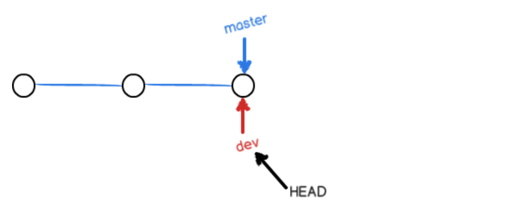
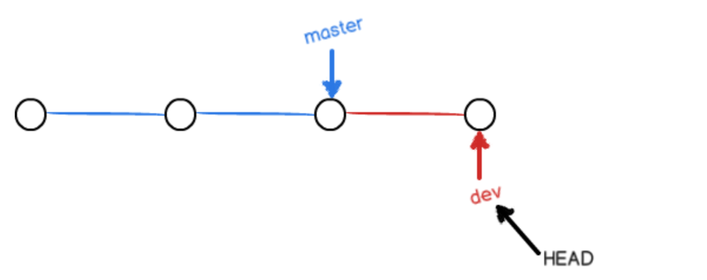
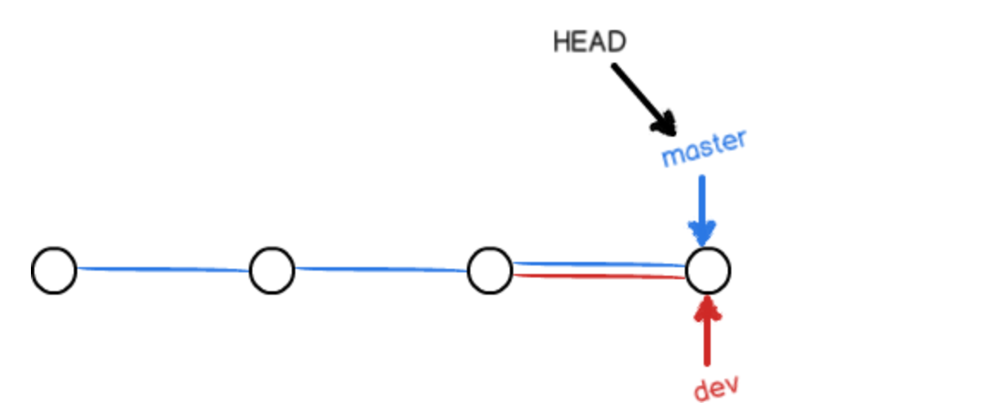
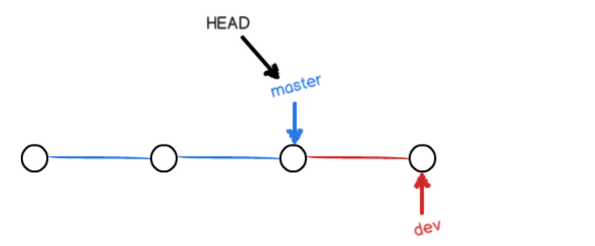
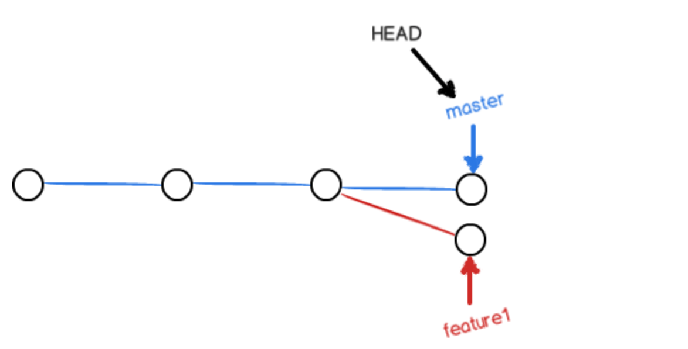
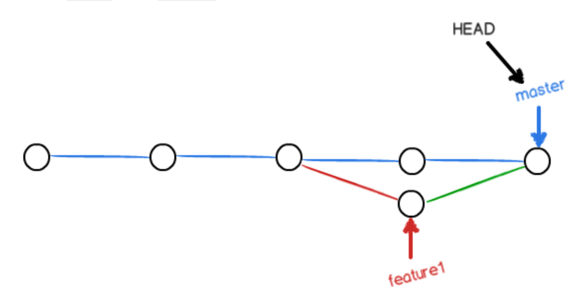
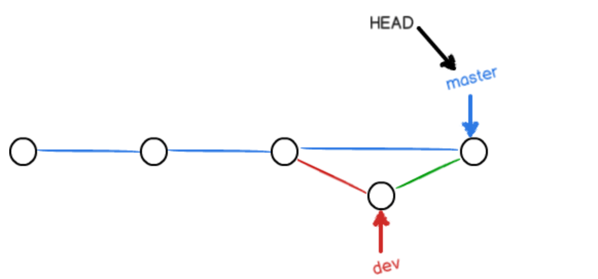
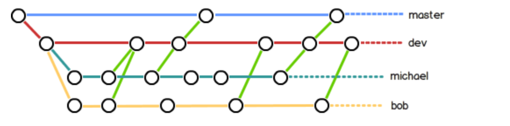

### [分支管理](https://www.liaoxuefeng.com/wiki/896043488029600/896954848507552#0)

分支在实际中的作用:

​		假设你准备开发一个新功能, 但是需要两周才能完成, 第一周你写了50%的代码, 如果立刻提交, 由于代码还没写完, 不完整的代码库会导致别人不能干活了. 如果等代码全部写完再一次提交, 又存在丢失每天进度的巨大风险. 

​		现在有了分支，就不用怕了。你创建了一个属于你自己的分支，别人看不到，还继续在原来的分支上正常工作，而你在自己的分支上干活，想提交就提交，直到开发完毕后，再一次性合并到原来的分支上，这样，既安全，又不影响别人工作。

​		Git的分支是与众不同的，无论创建、切换和删除分支，Git在1秒钟之内就能完成！无论你的版本库是1个文件还是1万个文件。


#### [创建与合并分支](https://www.liaoxuefeng.com/wiki/896043488029600/900003767775424)

​		每次提交, Git都把它们串成一条时间线, 这条时间线就是一个分支. 截止到目前, 只有一条时间线, 这个分支叫主分支, 即`master`分支. `HEAD`严格来说不是指向提交, 而是指向`master`, `master`才是指向提交的, 所以, `HEAD`指向的就是当前分支. 

​		一开始的时候，`master`分支是一条线，Git用`master`指向最新的提交，再用`HEAD`指向`master`，就能确定当前分支，以及当前分支的提交点: 


​		每次提交, `master`就会向前移动一步. 


​		当我们创建新分支, 例如`dev`时, Git新建了一个指针叫`dev`，指向`master`相同的提交，再把`HEAD`指向`dev`，就表示当前分支在`dev`上：



​		不过，从现在开始，对工作区的修改和提交就是针对`dev`分支了，比如新提交一次后，`dev`指针往前移动一步，而`master`指针不变：



​		假如我们在`dev`上的工作完成了，就可以把`dev`合并到`master`上。Git怎么合并呢？最简单的方法，就是直接把`master`指向`dev`的当前提交，就完成了合并：




​		当然, 这只是理想情况下, 还是你一个人处理代码, 如果多人协作的话会造成贼复杂的冲突. 


下面开始理想情况的实战: 

1. 创建`dev`分支, 然后切换到`dev`分支: 

```shell
$ git checkout -b dev
Switched to a new branch 'dev'
```

​		`git checkout`命令加上`-b`参数表示创建并切换, 相当于以下两条命令: 

```shell
$ git branch dev
$ git checkout dev
Switched to branch 'dev'
```


2. 然后, `git branch`可以查看当前分支: 

```shell
$ git branch
* dev
  master
```

​		当前分支前面会标一个`*`号. 


3. 修改文件, 然后提交. 

```shell
$ git add readme.txt 
$ git commit -m "branch test"
[dev 4dc3a6b] branch test
 1 file changed, 31 insertions(+)
```


4. 切回`master`分支: 

```shell
$ git checkout master
Switched to branch 'master'
```

​	   切换回`master`分支后，再查看一个`readme.txt`文件，刚才添加的内容不见了！因为那个提交是在`dev`分支上，而`master`分支此刻的提交点并没有变：




5. 合并`dev`分支到`master`分支上: 

```shell
$ git merge dev
Updating 0d43254..7bd6a31
Fast-forward
 ...xx.md      | 41 +++++++++++++++++++++++++++++++++++++
 1 file changed, 41 insertions(+)
```

​		`git merge`命令用于合并指定分支到当前分支。合并后，再查看改动的内容，就可以看到，和`dev`分支的最新提交是完全一样的。


6. 合并后, 可以删除掉`dev`分支: 

```shell
$ git branch -d dev
Deleted branch dev (was b17d20e).
```


7. 使用`git branch`, 只剩`master`分支: 

```shell
$ git branch
* master
```

​		因为创建、合并和删除分支非常快，所以Git鼓励你使用分支完成某个任务，合并后再删掉分支，这和直接在`master`分支上工作效果是一样的，但过程更安全。


**switch**

我们注意到切换分支使用`git checkout `，而前面讲过的撤销修改则是`git checkout -- `，同一个命令，有两种作用，确实有点令人迷惑。

实际上，切换分支这个动作，用`switch`更科学。因此，最新版本的Git提供了新的`git switch`命令来切换分支：

创建并切换到新的`dev`分支，可以使用：

```shell
$ git switch -c dev
```

直接切换到已有的`master`分支，可以使用：

```shell
$ git switch master
```

使用新的`git switch`命令，比`git checkout`要更容易理解


##### 小结

Git鼓励大量使用分支：

查看分支：`git branch`

创建分支：`git branch <name> `

切换分支：`git checkout <name>`或者`git switch <name> `

创建+切换分支：`git checkout -b <name> `或者`git switch -c <name> `

合并某分支到当前分支：`git merge <name> `

删除分支：`git branch -d <name> `


#### [解决冲突](https://www.liaoxuefeng.com/wiki/896043488029600/900004111093344#0)

新建分支`feature1`

```shell
$ git switch -c feature1
Switched to a new branch 'feature1'
```


如果在`feature1`分支上修改文件, 并提交

```shell
$ git add .
$ git commit -m "modified feature1"
```


切换回`master`分支, 并且修改文件

```shell
$ git switch master
# 修改repo文件
$ git add . 
$ git commit -m "modified master"
```


现在, `master`分支和`feature1`分支各自分别有新的提交:




现在尝试合并两个分支:

```shell
$ git merge feature1
Auto-merging readme.txt
CONFLICT (content): Merge conflict in readme.txt
Automatic merge failed; fix conflicts and then commit the result.
```

**Automatic merge failed**, 合并冲突了, Git的快速合并没有成功, 并告诉我们`readme.md`存在冲突, 必须修改冲突再提交. 


使用`git status`会更清晰

```shell
$ git status
On branch master
Your branch is ahead of 'origin/master' by 2 commits.
  (use "git push" to publish your local commits)

You have unmerged paths.
  (fix conflicts and run "git commit")
  (use "git merge --abort" to abort the merge) #使用该命令将中止合并

Unmerged paths:
  (use "git add <file>..." to mark resolution)

	both modified:   readme.txt

no changes added to commit (use "git add" and/or "git commit -a")
```


直接查看`readme.txt`的内容, 用什么查看都行, `<<<, ===, >>>`这些是`Git`帮忙填充的: 

```
Git is a distributed version control system.
Git is free software distributed under the GPL.
Git has a mutable index called stage.
Git tracks changes of files.
<<<<<<< HEAD
Creating a new branch is quick & simple.
=======
Creating a new branch is quick AND simple.
>>>>>>> feature1
```

Git用`<<<<<<<`，`=======`，`>>>>>>>`标记出不同分支的内容，我们把`Git`的符号和冲突语句修改如下后保存：

```
Creating a new branch is quick and simple.
```


再提交: 

```shell
$ git add .
$ git commit -m "conflict fixed"
```




用带参数的`git log`也可以看到分支的合并情况：

```shell
$ git log --graph --pretty=oneline --abbrev-commit
*   cf810e4 (HEAD -> master) conflict fixed
|\  
| * 14096d0 (feature1) AND simple
* | 5dc6824 & simple
|/  
* b17d20e branch test
* d46f35e (origin/master) remove test.txt
* b84166e add test.txt
* 519219b git tracks changes
* e43a48b understand how stage works
* 1094adb append GPL
* e475afc add distributed
* eaadf4e wrote a readme file
```


最后, 删除`feature1`分支: 

```shell
$ git branch -d feature1
Deleted branch feature1 (was 14096d0).
```


##### 小结

当Git无法自动合并分支时, 就必须首先解决冲突. 解决冲突后, 再提交, 合并完成. 

解决冲突就是把Git合并失败的文件**手动编辑**为我们希望的内容，再提交。

用`git log --graph`命令可以看到分支合并图。


#### [分支管理策略](https://www.liaoxuefeng.com/wiki/896043488029600/900005860592480#0)

通常，合并分支时，如果可能，Git会用`Fast forward`模式，但这种模式下，删除分支后，会丢掉分支信息。

如果要强制禁用`Fast forward`模式，Git就会在merge时生成一个新的commit，这样，从分支历史上就可以看出分支信息。

下面我们实战一下`--no-ff`方式的`git merge`：

首先，仍然创建并切换`dev`分支：

```shell
$ git switch -c dev
Switched to a new branch 'dev'
```

修改readme.txt文件，并提交一个新的commit：

```shell
$ git add readme.txt 
$ git commit -m "add merge"
[dev f52c633] add merge
 1 file changed, 1 insertion(+)
```

现在，我们切换回`master`：

```shell
$ git switch master
Switched to branch 'master'
```

准备合并`dev`分支，请注意`--no-ff`参数，表示禁用`Fast forward`：

```shell
$ git merge --no-ff -m "merge with no-ff" dev
Merge made by the 'recursive' strategy.
 readme.txt | 1 +
 1 file changed, 1 insertion(+)
```

因为本次合并要创建一个新的commit，所以加上`-m`参数，把commit描述写进去。

合并后，我们用`git log`看看分支历史：

```shell
$ git log --graph --pretty=oneline --abbrev-commit
*   e1e9c68 (HEAD -> master) merge with no-ff
|\  
| * f52c633 (dev) add merge
|/  
*   cf810e4 conflict fixed
...
```

可以看到，不使用`Fast forward`模式，merge后就像这样：



##### 分支策略

在实际开发中，我们应该按照几个基本原则进行分支管理：

首先，`master`分支应该是非常稳定的，也就是仅用来发布新版本，平时不能在上面干活；

那在哪干活呢？干活都在`dev`分支上，也就是说，`dev`分支是不稳定的，到某个时候，比如1.0版本发布时，再把`dev`分支合并到`master`上，在`master`分支发布1.0版本；

你和你的小伙伴们每个人都在`dev`分支上干活，每个人都有自己的分支，时不时地往`dev`分支上合并就可以了。

所以，团队合作的分支看起来就像这样：



##### 小结

Git分支十分强大，在团队开发中应该充分应用。

合并分支时，加上`--no-ff`参数就可以用普通模式合并，合并后的历史有分支，能看出来曾经做过合并，而`fast forward`合并就看不出来曾经做过合并。


#### [Bug分支](https://www.liaoxuefeng.com/wiki/896043488029600/900388704535136)

遇到bug了, 你希望创建一个分支`issue-101`来修复它, 但是, 你的`dev`分支上的工作还没提交, 而且你还没完成, 还没法提交, 预计完成还需要一天时间. 但bug需要在两小时内修复. 

Git 提供了一个`stash`功能, 可以把当前的工作现场存起来, 等以后再恢复工作

```shell
$ git stash
Saved working directory and index state WIP on dev: f52c633 add merge
```


用`git status`查看工作区, 发现很干净. 

然后你决定再哪个分支修复bug, 假定再`master`分支上修复, 就从`master`创建临时分支: 

```shell
$ git checkout master
$ git checkout -b issue-101
```


修复bug, 然后提交: 

```shell
$ git add .
$ git commit -m "fix bug 101"
```


切换到`master`, 完成合并, 并删除`issue-101`分支: 

```shell
$ git switch master
$ git merge -no-ff -m "merge bug fix 101" issue-101
$ git branch -d issue-101
```


bug 修改完成, 换回`dev`分支干活: 

```shell
$ git switch dev
$ git status
On branch dev
nothing to commit, working tree clean
```

发现`dev`空空如也, 因为上面用`git stash`把内容藏起来了. 

你可以用两个方法恢复: 

一是用`git stash apply`恢复，但是恢复后，stash内容并不删除，你需要用`git stash drop`来删除；

另一种方式是用`git stash pop`，恢复的同时把stash内容也删了：

另一种方式是用`git stash pop`，恢复的同时把stash内容也删了：

```shell
$ git stash pop
On branch dev
Changes to be committed:
  (use "git reset HEAD <file>..." to unstage)

	new file:   hello.py

Changes not staged for commit:
  (use "git add <file>..." to update what will be committed)
  (use "git checkout -- <file>..." to discard changes in working directory)

	modified:   readme.txt

Dropped refs/stash@{0} (5d677e2ee266f39ea296182fb2354265b91b3b2a)
```

再用`git stash list`查看，就看不到任何stash内容了：

```shell
$ git stash list
```

你可以多次stash，恢复的时候，先用`git stash list`查看，然后恢复指定的stash，用命令：

```shell
$ git stash apply stash@{0}
```


在master分支修复bug, 那dev分支也有bug. 为了方便修改, Git专门提供了`cherry-pick`命令, 用于复制一个特定的提交到当前分支: 

```shell
$ git branch
* dev
  master
$ git cherry-pick 4c805e2
[master 1d4b803] fix bug 101
 1 file changed, 1 insertion(+), 1 deletion(-)
```

`4c805e2`是上次修改bug提交的ID. 


##### 小结

修复bug时，我们会通过创建新的bug分支进行修复，然后合并，最后删除；

当手头工作没有完成时，先把工作现场`git stash`一下，然后去修复bug，修复后，再`git stash pop`，回到工作现场；

在master分支上修复的bug，想要合并到当前dev分支，可以用`git cherry-pick `命令，把bug提交的修改“复制”到当前分支，避免重复劳动。


#### [Feature分支](https://www.liaoxuefeng.com/wiki/896043488029600/900394246995648)

添加一个新功能时，你肯定不希望因为一些实验性质的代码，把主分支或者`dev`分支搞乱了，所以，每添加一个新功能，最好新建一个feature分支，在上面开发，完成后，合并，最后，删除该feature分支。


现在，你终于接到了一个新任务：开发代号为Vulcan的新功能，该功能计划用于下一代星际飞船。

于是准备开发：

```shell
$ git switch -c feature-vulcan
Switched to a new branch 'feature-vulcan'
```

5分钟后，开发完毕：

```shell
$ git add vulcan.py

$ git status
On branch feature-vulcan
Changes to be committed:
  (use "git reset HEAD <file>..." to unstage)

	new file:   vulcan.py

$ git commit -m "add feature vulcan"
[feature-vulcan 287773e] add feature vulcan
 1 file changed, 2 insertions(+)
 create mode 100644 vulcan.py
```

切回`dev`，准备合并：

```shell
$ git switch dev
```

一切顺利的话，feature分支和bug分支是类似的，合并，然后删除。

但是！

就在此时，接到上级命令，因经费不足，新功能必须取消！

虽然白干了，但是这个包含机密资料的分支还是必须就地销毁：

```shell
$ git branch -d feature-vulcan
error: The branch 'feature-vulcan' is not fully merged.
If you are sure you want to delete it, run 'git branch -D feature-vulcan'.
```

销毁失败。Git友情提醒，`feature-vulcan`分支还没有被合并，如果删除，将丢失掉修改，如果要强行删除，需要使用大写的`-D`参数。。

现在我们强行删除：

```shell
$ git branch -D feature-vulcan
Deleted branch feature-vulcan (was 287773e).
```

终于删除成功！


##### 小结

开发一个新feature，最好新建一个分支；

如果要丢弃一个没有被合并过的分支，可以通过`git branch -D `强行删除。


#### [多人协作](https://www.liaoxuefeng.com/wiki/896043488029600/900375748016320)

查看远程库信息, 用`git remote`:

```shell
$ git remote
origin
```

或者, 用`git remote -v`显示更详细信息: 

```shell
$ git remote -v
origin  git@github.com:michaelliao/learngit.git (fetch)
origin  git@github.com:michaelliao/learngit.git (push)
```

`fetch`是可以抓取的`origin`的地址, `push`是可以推送的`origin`地址. 如果没有推送权限, 就看不到`push`的地址. 


##### 推送分支

把该分支上的所有本地提交推送到远程库. 推送时, 指定远程分支, 和本地分支. 

```shell
$ git push origin master
```

如果要推送其他分支, 比如`dev`, 就改成: 

```shell
$ git push origin dev
```


哪些分支需要推送, 哪些不需要?

+ `master`分支是主分支, 要时刻与远程同步;
+ `dev`分支是开发分支, 团队所有成员都需要在上面工作, 所以也需要与远程同步. 
+ `bug`分支用于本地修改bug, 没必要推送到远程了. 
+ `feature`分支是功能分支, 是否推送取决于该功能你有没有和你的小伙伴合作开发该功能. 


##### 抓取分支


