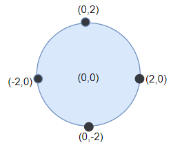

### [5412. 在既定时间做作业的学生人数](https://leetcode-cn.com/problems/number-of-students-doing-homework-at-a-given-time/)

给你两个整数数组 `startTime`（开始时间）和 `endTime`（结束时间），并指定一个整数 `queryTime` 作为查询时间。

已知，第 i 名学生在 `startTime[i]` 时开始写作业并于 `endTime[i]` 时完成作业。

请返回在查询时间 `queryTime` 时正在做作业的学生人数。形式上，返回能够使 `queryTime `处于区间 `[startTime[i], endTime[i]]`（含）的学生人数。

 

示例 1：

```
输入：startTime = [1,2,3], endTime = [3,2,7], queryTime = 4
输出：1
解释：一共有 3 名学生。
第一名学生在时间 1 开始写作业，并于时间 3 完成作业，在时间 4 没有处于做作业的状态。
第二名学生在时间 2 开始写作业，并于时间 2 完成作业，在时间 4 没有处于做作业的状态。
第二名学生在时间 3 开始写作业，预计于时间 7 完成作业，这是是唯一一名在时间 4 时正在做作业的学生。
```

示例 2：

```
输入：startTime = [4], endTime = [4], queryTime = 4
输出：1
解释：在查询时间只有一名学生在做作业。
```

示例 3：

```
输入：startTime = [4], endTime = [4], queryTime = 5
输出：0
```

示例 4：

```
输入：startTime = [1,1,1,1], endTime = [1,3,2,4], queryTime = 7
输出：0
```

示例 5：

```
输入：startTime = [9,8,7,6,5,4,3,2,1], endTime = [10,10,10,10,10,10,10,10,10], queryTime = 5
输出：5
```

提示：

+ `startTime.length` == `endTime.length`
+ `1 <= startTime.length <= 100`
+ `1 <= startTime[i] <= endTime[i] <= 1000`
+ `1 <= queryTime <= 1000`


#### 思路

开胃菜, 直接遍历即可, 如果`queryTime` >= `startTime` && `queryTime` <= `endTime`, `result++`


#### 状态: AC

#### 提交代码

```java
class Solution {
    public int busyStudent(int[] startTime, int[] endTime, int queryTime) {
        int count = 0;
        for(int i=0;i < startTime.length; i++) {
            if(startTime[i] > queryTime) 
            else {
                if(endTime[i] >= queryTime)
                    count++;
            }
        }
        return count;
    }
}
```


### [5413. 重新排列句子中的单词](https://leetcode-cn.com/problems/rearrange-words-in-a-sentence/)

「句子」是一个用空格分隔单词的字符串。给你一个满足下述格式的句子 text :

+ 句子的首字母大写

+ text 中的每个单词都用单个空格分隔。

请你重新排列 text 中的单词，使所有单词按其长度的升序排列。如果两个单词的长度相同，则保留其在原句子中的相对顺序。

请同样按上述格式返回新的句子。


**示例 1：**

```
输入：text = "Leetcode is cool"
输出："Is cool leetcode"
解释：句子中共有 3 个单词，长度为 8 的 "Leetcode" ，长度为 2 的 "is" 以及长度为 4 的 "cool" 。
输出需要按单词的长度升序排列，新句子中的第一个单词首字母需要大写。
```

**示例 2：**

```
输入：text = "Keep calm and code on"
输出："On and keep calm code"
解释：输出的排序情况如下：
"On" 2 个字母。
"and" 3 个字母。
"keep" 4 个字母，因为存在长度相同的其他单词，所以它们之间需要保留在原句子中的相对顺序。
"calm" 4 个字母。
"code" 4 个字母。
```


**示例 3：**

```
输入：text = "To be or not to be"
输出："To be or to be not"
```


**提示：**

- `text` 以大写字母开头，然后包含若干小写字母以及单词间的单个空格。
- `1 <= text.length <= 10^5`


#### 思路: 

+ 用`str.split()`把text分解成数组

+ 然后对数组进行排序
+ 拼接字符串

+ 再将字符串全部转换成小写, 把首字母转换成大写


本来想自己写快排进行排序, 发现自己对java的`Arrays.sort()`使用还不是很熟悉, 所以就使用`Arrays.sort()`进行排序(主要是不会写快排`

`Arrays.sort()`使用的是双轴快排的算法(但对于很小的数组会使用插入排序), 通常比传统的快排效率更高. 


#### 状态: AC

#### 提交代码: 

```java
class Solution {
    public String arrangeWords(String text) {
        //先划分为数组, 按照空格划分
        String[] textArray = text.split(" ");
        
        //重写compare接口, 对字符数组排序. 
        Comparator cmp = new CMP();
        Arrays.sort(textArray, cmp);
        System.out.println(Arrays.toString(textArray));
        
        StringBuffer res = new StringBuffer("");
        for(String s: textArray) {
            res.append(s);
            res.append(" ");
        }
        
        res.deleteCharAt(res.length()-1);
        
        res.replace(0,res.length()-1,
               	res.substring(0,res.length()-1).toLowerCase());
        res.replace(0,1,res.substring(0,1).toUpperCase());
        
        return res.toString();
    }
}

class CMP implements Comparator<String> {
    public int compare(String a, String b) {
        if(a.length() == b.length())
            return 0;
        else if(a.length() > b.length())
            return 1;
        else
            return -1;

    }
}
```


#### 优化代码: 

暂无


### [1452. 收藏清单](https://leetcode-cn.com/problems/people-whose-list-of-favorite-companies-is-not-a-subset-of-another-list/)

给你一个数组 favoriteCompanies ，其中 favoriteCompanies[i] 是第 i 名用户收藏的公司清单（下标从 0 开始）。

请找出不是其他任何人收藏的公司清单的子集的收藏清单，并返回该清单下标。下标需要按升序排列。

**示例 1：**

```

输入：favoriteCompanies = [["leetcode","google","facebook"],["google","microsoft"],["google","facebook"],["google"],["amazon"]]
输出：[0,1,4] 
解释：
favoriteCompanies[2]=["google","facebook"] 是 favoriteCompanies[0]=["leetcode","google","facebook"] 的子集。
favoriteCompanies[3]=["google"] 是 favoriteCompanies[0]=["leetcode","google","facebook"] 和 favoriteCompanies[1]=["google","microsoft"] 的子集。
其余的收藏清单均不是其他任何人收藏的公司清单的子集，因此，答案为 [0,1,4]
```

**示例 2：**

```
输入：favoriteCompanies = [["leetcode","google","facebook"],
["leetcode","amazon"],["facebook","google"]]
输出：[0,1] 
解释：favoriteCompanies[2]=["facebook","google"] 是 favoriteCompanies[0]=["leetcode","google","facebook"] 的子集，因此，答案为 [0,1]
```

**示例 3：**

```
输入：favoriteCompanies = [["leetcode"],["google"],["facebook"],["amazon"]]
输出：[0,1,2,3]
```

**提示：**

- `1 <= favoriteCompanies.length <= 100`
- 1 <= favoriteCompanies[i].length <= 500
- 1 <= favoriteCompanies[i][j].length <= 20
- favoriteCompanies[i] 中的所有字符串 各不相同 。
- 用户收藏的公司清单也 各不相同 ，也就是说，即便我们按字母顺序排序每个清单， favoriteCompanies[i] != favoriteCompanies[j] 仍然成立。
- 所有字符串仅包含小写英文字母。


#### 思路

只想得到暴力穷举, 然后做了下优化

**思路一:** 

+ 为每个用户设置一个flag位, 默认置0

+ 根据清单中元素的大小, 找出最大父集, flag置2
+ 和其他全部集比较, 如果清单被父集包含, flag置1
+ 重复1~3步骤, 直到所有flag != 0

该思路最大复杂度还是 $ O(n^2)$, 本来觉得这样减少了循环, 但是由于要找出父集, 需要排序, 反而增多了循环. 


**思路二:** 

+ 为每个用户设置一个flag位, 默认置0, 如果被包含则置1
+ 从第一个开始, 设为 `i` , 每次比较 `flag != 1`的其他用户, 设为 `j ( i < j)`, 如果i被包含, `flag_i = 1`, 如果`j`被`i`包含, `flag_j = 1`. 
+ 比较结束后`flag_i == 0`则加到结果`List_Res`中. 

该思路最大复杂度为$ O(n^2/2) $, 最小为 $ O(n) $, 虽然复杂度还是`O(n^2)`, 但减轻了许多. 


这道题最大的难点在于求包含关系, 因为`List`在java中也是一个`Set`, 有`containsAll()`, 我拿来直接使用, 但这是超时的, 导致我一直在思考我的思路是不是有问题. (当时没想到是`containsAll()`算法的问题, 我也没有思路去写一个更简单的求包含函数). 

比赛结束后, 我才明白`List`查找一个元素是否包含要用到遍历，时间复杂度是$ O(n) , $` Set`的查找是通过哈希来实现的，判断是否包含某个元素的实现，时间复杂度是O（1） 对于 `containsAll`还得看看源码. 

所以说还要把`List`转换为`set`...

#### 状态: Timeout

#### 提交代码

```
class Solution {
    public List<Integer> peopleIndexes(List<List<String>> favoriteCompanies) {
        int[] userNum = new int[favoriteCompanies.size()];
        int[] companiesNum = new int[favoriteCompanies.size()];
        
        
        for(int i = 0; i < favoriteCompanies.size();i++) {
            if(userNum[i] == 1) {
                continue;
            }
            
            for(int j = i+1; j < favoriteCompanies.size();j++ ) {
                if(userNum[j] == 1) {
                     continue;
                }
                if(favoriteCompanies.get(j).containsAll(favoriteCompanies.get(i))) {
                    userNum[i] = 1;
                }
                if(favoriteCompanies.get(i).containsAll(favoriteCompanies.get(j))) {
                    userNum[j] = 1;
                }
            }
        } 
        
        List<Integer> res = new ArrayList<>();
        
        for(int i = 0; i < favoriteCompanies.size();i++) {
             if(userNum[i] == 0) {
                res.add(i);
             }
         }
        
        return res;
    }
}
```


#### 优化代码

```

```


#### [1453. 圆形靶内的最大飞镖数量](https://leetcode-cn.com/problems/maximum-number-of-darts-inside-of-a-circular-dartboard/)

墙壁上挂着一个圆形的飞镖靶。现在请你蒙着眼睛向靶上投掷飞镖。

投掷到墙上的飞镖用二维平面上的点坐标数组表示。飞镖靶的半径为 r 。

请返回能够落在 任意 半径为 r 的圆形靶内或靶上的最大飞镖数。

 

**示例 1：**



```
输入：points = [[-2,0],[2,0],[0,2],[0,-2]], r = 2
输出：4
解释：如果圆形的飞镖靶的圆心为 (0,0) ，半径为 2 ，所有的飞镖都落在靶上，此时落在靶上的飞镖数最大，值为 4 。
```


**示例 2：**

```
输入：points = [[-3,0],[3,0],[2,6],[5,4],[0,9],[7,8]], r = 5
输出：5
解释：如果圆形的飞镖靶的圆心为 (0,4) ，半径为 5 ，则除了 (7,8) 之外的飞镖都落在靶上，此时落在靶上的飞镖数最大，值为 5 。
```


**示例 3：**

```
输入：points = [[-2,0],[2,0],[0,2],[0,-2]], r = 1
输出：1
```


**示例 4：**

```
输入：points = [[1,2],[3,5],[1,-1],[2,3],[4,1],[1,3]], r = 2
输出：4
```


**提示：**

+ 1 <= points.length <= 100
+ points[i].length == 2
+ -10^4 <= points[i][0], points[i][1] <= 10^4
+ 1 <= r <= 5000

#### 思路

#### 状态

#### 提交代码

#### 优化代码

