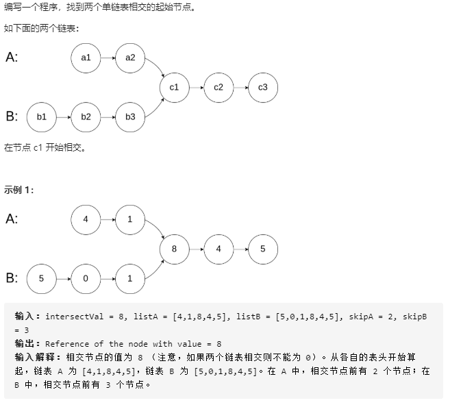
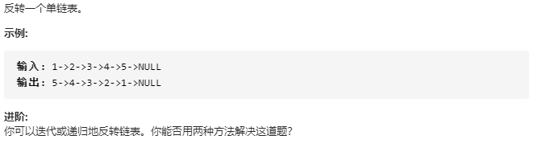
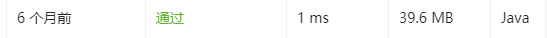

[链表](https://github.com/CyC2018/CS-Notes/blob/master/notes/Leetcode%20%E9%A2%98%E8%A7%A3%20-%20%E9%93%BE%E8%A1%A8.md)

### 1. 相交链表

[习题地址](https://leetcode-cn.com/problems/intersection-of-two-linked-lists/)



**我的题解: **

通过`hashSet`把A的地址都放进去, 然后用B的地址去查看A是否已经存在此地址. 

```java
/**
 * Definition for singly-linked list.
 * public class ListNode {
 *     int val;
 *     ListNode next;
 *     ListNode(int x) {
 *         val = x;
 *         next = null;
 *     }
 * }
 */
public class Solution {
    public ListNode getIntersectionNode(ListNode headA, ListNode headB) {
        HashSet<ListNode> isExist = new HashSet<ListNode>();
        ListNode through = headA;
        while(through != null) {
            isExist.add(through);
            through = through.next;
        }
        through = headB;
        while(through != null) {
            if(isExist.contains(through)) {
                return through;
            }
            through = through.next;
        }
        return null;
    }
```

时间复杂度为O(n), 空间复杂度也为O(n). 

虽然也是遍历了A, B一次, `hashSet`的查找是`O(1)`, 但是速度还是很慢, 可能构建`hashSet`和存放元素导致开销比较大. 

> 执行用时：9 ms, 在所有 Java 提交中击败了15.18%的用户
>
> 内存消耗：43.5 MB, 在所有 Java 提交中击败了7.14%的用户


**最佳题解: **

题解很巧妙, 而且时间复杂度为O(n), 空间复杂度为O(1)


设A的前面部分长度为a, B的前面部分为b, 公共部分为c

则长度: A+B=a+c+b+`c` = b+c+a+`c`=B+A

这样可以通过一次遍历找到最后一个c部分的起始位置. 


而且代码写的很精妙: 

```java
public ListNode getIntersectionNode(ListNode headA, ListNode headB) {
    ListNode l1 = headA, l2 = headB;
    while (l1 != l2) {
        l1 = (l1 == null) ? headB : l1.next;
        l2 = (l2 == null) ? headA : l2.next;
    }
    return l1;
}
```


### 2. 链表反转

[习题地址](<https://leetcode-cn.com/problems/reverse-linked-list/description/>)



**我的题解①: **

首先想到的是用栈的方法, 但是题目已经给了, 所以毫无成就感. 

```java
/**
 * Definition for singly-linked list.
 * public class ListNode {
 *     int val;
 *     ListNode next;
 *     ListNode(int x) { val = x; }
 * }
 */
class Solution {
    public ListNode reverseList(ListNode head) {
        if(head == null) return null;
        Stack<ListNode> stack = new Stack<ListNode>();
        while(head != null) {
            stack.push(head);
            head = head.next;
        }
        ListNode resHead = stack.pop();	//res不能直接使用head, 这样会触发异常. 
        ListNode cur = resHead;
        while(!stack.empty()) {
            stack.peek().next = null;	//不这样写的话会报ListNode.next循环的错, 事实确实如此.栈顶节点指向下一个节点, 下一个节点又指向了栈顶节点. 
            cur.next = stack.pop();
            cur = cur.next;
        }
        return resHead;
    }
}
```

运行情况惨不忍睹: 

> 执行用时：1 ms, 在所有 Java 提交中击败了5.06%的用户
>
> 内存消耗：39.3 MB, 在所有 Java 提交中击败了5.06%的用户

使用栈的方法实现要遍历两遍, 而且栈也有空间消耗. 但是为什么我的速度没用别人用迭代的快啊???


**我的题解②:  **

```java
/**
 * Definition for singly-linked list.
 * public class ListNode {
 *     int val;
 *     ListNode next;
 *     ListNode(int x) { val = x; }
 * }
 */
class Solution {
    public ListNode reverseList(ListNode head) {
        if(head == null || head.next == null) return head;

        
        ListNode resHead = null;
        ListNode previous = null;
        ListNode current = head;
        while(current != null) {
            resHead = current;
            current = current.next;
            resHead.next = previous;
            previous = resHead;
        }
        return resHead;
    }
}
```

很垃圾, 明明懂得原理, 但是就是写了很久...

不知道`previous`, `current`, `resHead`之间怎么传递, 还有原本的`head`会形成闭环, 这些小问题令我在明白原理下还写了半个小时...

现在就是用`resHead`永远指向当前头, 从`head`开始, 然后不断令`resHead.next`指向`previous`, `previous`的初始值为`null`, 这样可以解决闭环问题...

这样结果不错, 起码时间变快了, 但是为什么空间还是那么差劲???已经是`O(1)`了吧...

> 执行用时：0 MS, 在所有 Java 提交中击败了100.00%的用户
>
> 内存消耗：39.6 MB, 在所有 Java 提交中击败了5.06%的用户


### 3. 合并两个有序链表

将两个升序链表合并为一个新的 **升序** 链表并返回。新链表是通过拼接给定的两个链表的所有节点组成的。 

```
输入：1->2->4, 1->3->4
输出：1->1->2->3->4->4
```

**我的题解: **

拿一个链表做容器, 不断在正确顺序中插入另一个链表的值. 

```java
/**
 * Definition for singly-linked list.
 * public class ListNode {
 *     int val;
 *     ListNode next;
 *     ListNode() {}
 *     ListNode(int val) { this.val = val; }
 *     ListNode(int val, ListNode next) { this.val = val; this.next = next; }
 * }
 */
class Solution {
    public ListNode mergeTwoLists(ListNode l1, ListNode l2) {
        if(l1 == null || l2 == null) return l1==null ? l2:l1;
        ListNode currentl1 = l1;
        ListNode currentl2 = l2;
        ListNode temp2 = null;
        while(currentl1 != null && currentl2 != null) {
            if(currentl1.val < currentl2.val) {
                if(currentl1.next == null) {        //l1遍历完, 把l2接上, 结束
                    currentl1.next = currentl2;
                    break;
                }
                currentl1 = currentl1.next;
                
            }
            else {
                int temp = currentl1.val;
                currentl1.val = currentl2.val;
                currentl2.val = temp;
                temp2 = currentl2.next;     //暂存currentl2的后继结点
                currentl2.next = currentl1.next;
                currentl1.next = currentl2;
                currentl1 = currentl2;
                currentl2 = temp2;
            }
        }
        return l1;
    }
}
```

复杂度`O(n)`, 用了值交换的技巧...

> 执行用时：1 ms, 在所有 Java 提交中击败了62.39%的用户
>
> 内存消耗：39.8 MB, 在所有 Java 提交中击败了38.32%的用户


然而, 我发现这道题, 我六个月前做过, 而且还做的比我好...



...mmp了


**我的题解②: (六个月前的**

这是教科书版标准答案, 明明今晚看数据结构的时候才学了...

弄一个表头, 然后不断比较两个链, 插入, 最后补上多余的那条链.

```java
/**
 * Definition for singly-linked list.
 * public class ListNode {
 *     int val;
 *     ListNode next;
 *     ListNode(int x) { val = x; }
 * }
 */
class Solution {
    public ListNode mergeTwoLists(ListNode l1, ListNode l2) {
        ListNode ResHead = new ListNode(-1);
        ListNode Res = ResHead;
        
        while((l1 != null)&&(l2 != null)) {
            if(l1.val <= l2.val) {
                Res.next = l1;
                l1= l1.next;
            }
            else {
                Res.next = l2;
                l2 = l2.next;
            }
            Res = Res.next;
        }

        Res.next = (l1 == null)? l2: l1;
        return ResHead.next;
    }
}
```

其实递归更简单...


### 4. 从有序链表中删除重复节点

给定一个排序链表，删除所有重复的元素，使得每个元素只出现一次。

```
输入: 1->1->2
输出: 1->2
```


我发现这题也做过, 五个月前, 这次比上次好一点点

**我的题解①: **

当前和前一个比较是否相同, 就ok了. 

```java
/**
 * Definition for singly-linked list.
 * public class ListNode {
 *     int val;
 *     ListNode next;
 *     ListNode(int x) { val = x; }
 * }
 */
class Solution {
    public ListNode deleteDuplicates(ListNode head) {
        if(head == null || head.next == null) return head;
        ListNode cur = head;
        while(cur.next != null) {
            if(cur.val == cur.next.val) cur.next = cur.next.next;
            else cur = cur.next;
        }
        return head;
    }
}
```

复杂度`O(n)`

> 执行用时：0 ms, 在所有 Java 提交中击败了100.00%的用户
>
> 内存消耗：39.4 MB, 在所有 Java 提交中击败了5.97%的用户


**我的题解②: (五个月前)**

```java
/**
 * Definition for singly-linked list.
 * public class ListNode {
 *     int val;
 *     ListNode next;
 *     ListNode(int x) { val = x; }
 * }
 */
class Solution {
    public ListNode deleteDuplicates(ListNode head) {
        if(head == null)
            return head;
        ListNode count = head;
        while(count.next != null) {
            if( count.val == count.next.val) {
                count.next = count.next.next != null ? count.next.next: null;
            }
            else {
                count = count.next;
            }
        }
        return head;
    }
}
```

和我这次写的一样啊...

就是`count.next = count.next.next != null ? count.next.next: null;`这句有点多余...

我估计题解一比这个快一点的原因就是我多了一个`head`只有一个节点的判断...


### 5. 删除链表的倒数第 n 个节点

给定一个链表，删除链表的倒数第 *n* 个节点，并且返回链表的头结点。

```
给定一个链表: 1->2->3->4->5, 和 n = 2.

当删除了倒数第二个节点后，链表变为 1->2->3->5.
```


**我的题解: **

显然用两次扫描实现很low, 所以争取用一次扫描实现. 

本来想的是用递归的, 发现这样效率比两次遍历还低, 直接看答案去了. 

发现思路是双指针, 妙啊, 先让`p`指针指向第`n`个节点, 然后令`b`指针指向头节点, 当`p`指针到末尾的时候, `b`指针就指向正确节点了...

> 本来想的把`b`的下一个值与`b`互换, 删掉b的下一个值, 就得出正确答案了, 但是发现`b`是末尾的时候...删不掉了, mmp, 于是加个判断呗, 如果n=1, 则直接删掉.

因为`n`合法, 所以不需要做额外的判定了. 

> 才发现 while((n--) != 0) 这个语句先判断了 不等于0才减的...

```java
/**
 * Definition for singly-linked list.
 * public class ListNode {
 *     int val;
 *     ListNode next;
 *     ListNode(int x) { val = x; }
 * }
 */
class Solution {
    public ListNode removeNthFromEnd(ListNode head, int n) {
        if(head == null || head.next == null) return null;
        ListNode p = head;
        boolean flag = false;
        if(n == 1) flag = true;
        while(n != 1) {
            p = p.next;
            n--;
        }
        ListNode b = head;
        while(p.next !=null) {
            if(flag && b.next.next == null) {
                b.next = null;
                return head;
            }
            
            p = p.next;
            b = b.next;
        }
        b.val = b.next.val;
        b.next = b.next.next;
        return head;
    }
    
}
```

代码写的真的丑陋不堪...自己看着都想吐. 

> 执行用时：0 ms, 在所有 Java 提交中击败了100.00%的用户
>
> 内存消耗：38.1 MB, 在所有 Java 提交中击败了5.43%的用户


**最佳题解: **

我们可以设想假设设定了双指针 p 和 q 的话，当 q 指向末尾的 NULL，p 与 q 之间相隔的元素个数为 n 时，那么删除掉 p 的下一个指针就完成了要求。

- 设置虚拟节点 dummyHead 指向 head
- 设定双指针 p 和 q，初始都指向虚拟节点 dummyHead
- 移动 q，直到 p 与 q 之间相隔的元素个数为 n
- 同时移动 p 与 q，直到 q 指向的为 NULL
- 将 p 的下一个节点指向下下个节点

这样会很简洁, 而且不需要其他各种判断...mmp

```java
/**
 * Definition for singly-linked list.
 * public class ListNode {
 *     int val;
 *     ListNode next;
 *     ListNode(int x) { val = x; }
 * }
 */
class Solution {
    public ListNode removeNthFromEnd(ListNode head, int n) {
        if(head == null) return null;
        ListNode virtualHead = new ListNode(0);
        virtualHead.next = head;
        ListNode q=head;
        ListNode p=virtualHead;
        while(n != 1) {
            q = q.next;
            n--;
        }
        while(q.next != null) {
            q = q.next;
            p = p.next;
        }
        p.next = p.next.next;
        return virtualHead.next;
    }
    
}
```

这样子好简单啊...果然思路清晰很重要...

> 执行用时：0 ms, 在所有 Java 提交中击败了100.00%的用户
>
> 内存消耗：37.9 MB, 在所有 Java 提交中击败了5.43%的用户


### 6. 交换链表中的相邻结点

给定一个链表，两两交换其中相邻的节点，并返回交换后的链表。

**你不能只是单纯的改变节点内部的值**，而是需要实际的进行节点交换。

```
给定 1->2->3->4, 你应该返回 2->1->4->3.
```


**我的题解: **

前后指针, 把他们交换过来? 