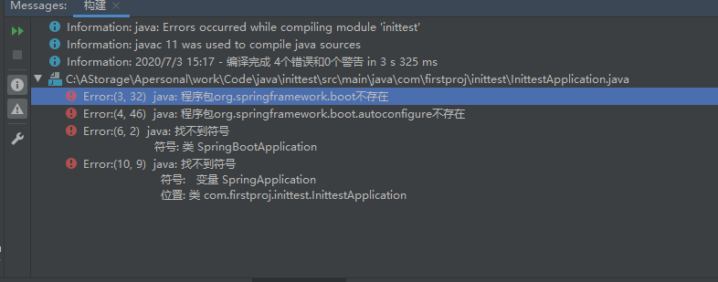
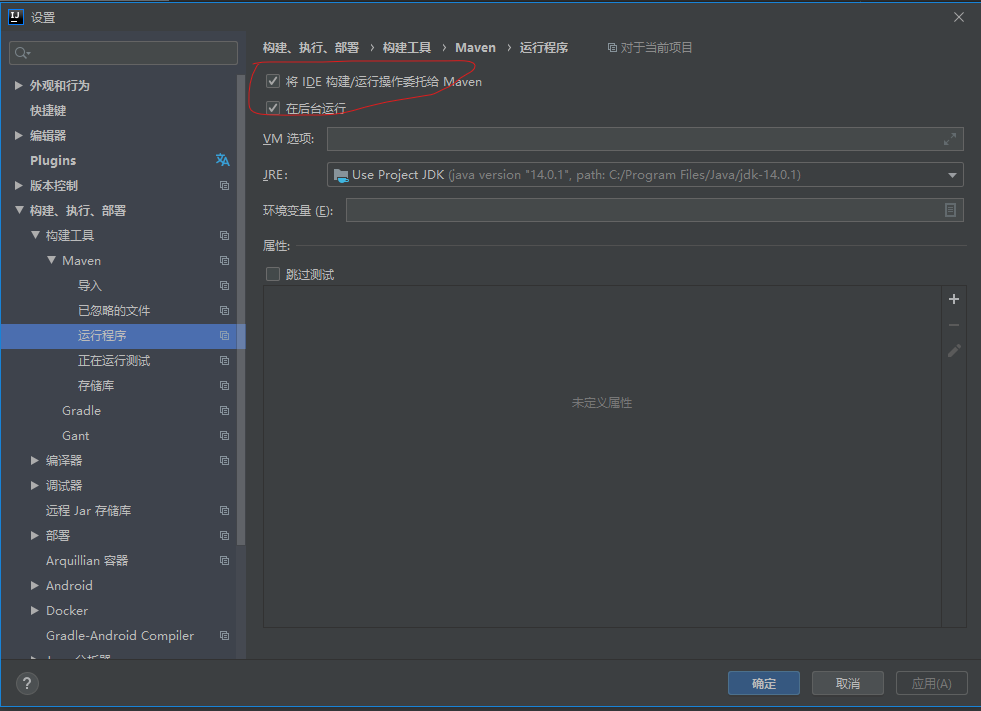
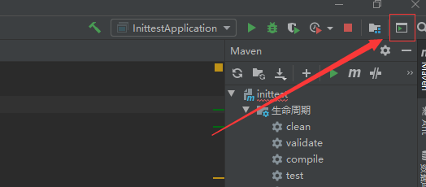

### intellij2020.1.2 版本使用spring initilizr 导入spring boot报错. 

#### 报错一: Error:(3, 32) java: 程序包org.springframework.boot不存在

打开setting->maven->runner, 把这个勾起, 再运行, 就能运行成功. 

#### 报错二: springframework 依赖会标红. 原因未知: 

#### 解决办法: 

运行此命令...就不会再标红. 

